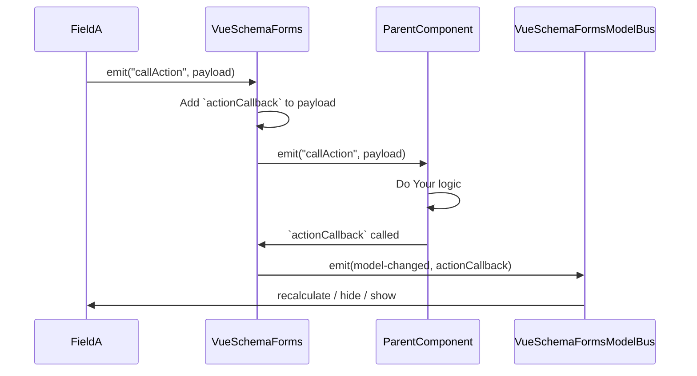
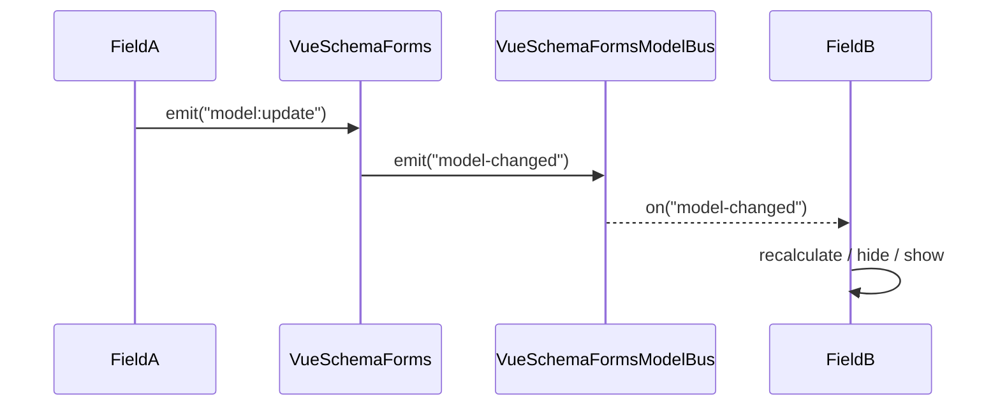
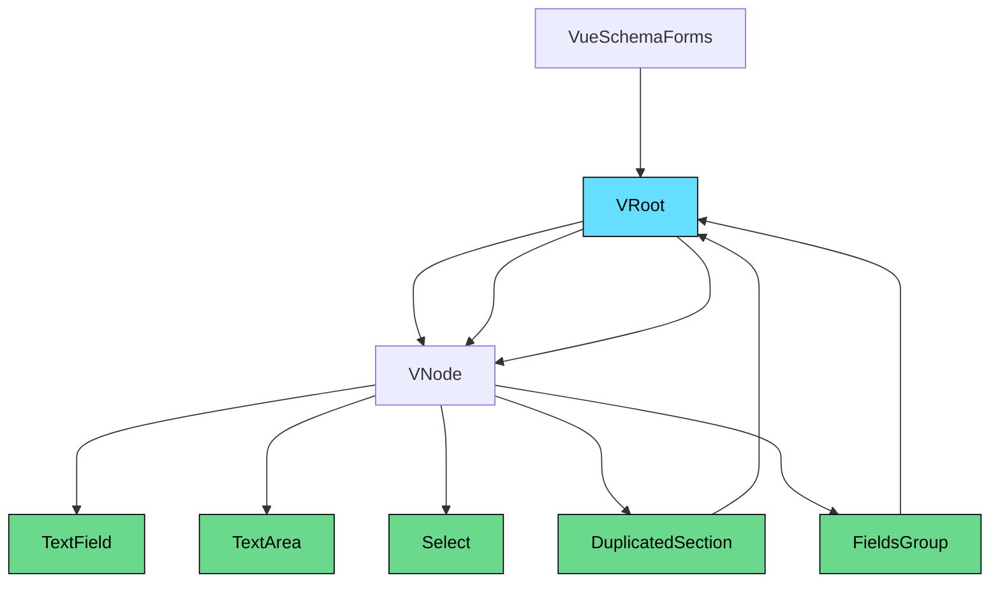
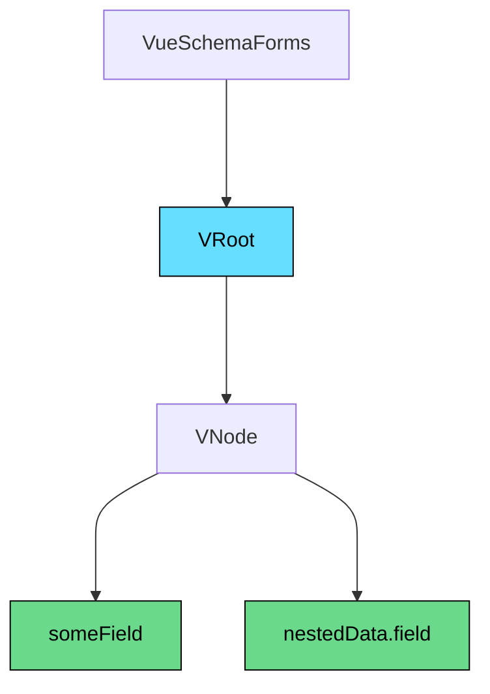

# Vue3 Schema Forms 🚀

> **Dynamic JSON Schema-powered forms for Vue 3 + Vuetify.**

Easily build dynamic, user-friendly, and customizable forms using JSON Schema, powered by [Vue 3](https://vuejs.org/)
and [Vuetify 3](https://next.vuetifyjs.com/).

Inspired by [vuetify-jsonschema-form](https://koumoul-dev.github.io/vuetify-jsonschema-form/latest/).

---

## 📚 Documentation

- **Storybook (live preview):** [View Demo](https://maciejdybowski.github.io/vue3-schema-forms/)
- **Changelog:** [See latest changes](https://maciejdybowski.github.io/vue3-schema-forms/?path=/docs/changelog--docs)

---

## ⚙️ Installation

```bash
npm install vue3-schema-forms
```

> **Peer dependencies required:**

```bash
npm install vue@3.4.14 vuetify@3.5.1 axios@1.6.5 dayjs@1.11.10 vue-i18n@9 vuedraggable@next
```

> **Optional for SFC i18n support:**

```bash
npm install -D @intlify/unplugin-vue-i18n@0.13.0
```

---

## ✨ Features

- 🚀 Dynamic form generation based on JSON Schema
- 🎨 Full Vuetify 3 integration
- 🌍 Built-in i18n support
- 🧩 Drag & Drop (with `vuedraggable`)
- 🔥 Form sections duplication
- 🛠️ Customizable validation and error display

---

## 📐 Quick Usage

```typescript
import { createVueSchemaForms } from 'vue3-schema-forms';

const schemaForms = createVueSchemaForms({});

createApp(App)
  .use(schemaForms)
  .mount('#app');
```

```vue

<template>
  <vue-schema-forms
    v-model="model"
    :schema="schema"
    :options="formOptions"
    :default-form-actions="true"
    validation-behaviour="messages"
  />
</template>

<script setup lang="ts">
  import { ref } from 'vue';

  const model = ref({});
  const formOptions = ref({});
  const schema = ref({
    type: 'object',
    properties: {
      field1: {
        label: 'Field 1',
        layout: {
          component: 'text-field',
        },
      },
    },
  });
</script>
```

---

## 📋 Props

| Name                  | Type                     | Default    | Description                                                                                    |
|-----------------------|--------------------------|------------|------------------------------------------------------------------------------------------------|
| `model`               | `object`                 | —          | Two-way binding for form values.                                                               |
| `schema`              | `Schema`                 | —          | JSON Schema object defining fields, types, and layouts.                                        |
| `options`             | `object`                 | —          | Global options applied to all fields.                                                          |
| `defaultFormActions`  | `boolean`                | `false`    | Toggles default form buttons (Submit / Reset).                                                 |
| `validationBehaviour` | `"scroll" \| "messages"` | `"scroll"` | Defines validation behavior after error (auto-scroll to first invalid field or show messages). |

---

## 📋 Emits

| Name          | Type     | Default | Description                                                                                                                                                                                      |
|---------------|----------|---------|--------------------------------------------------------------------------------------------------------------------------------------------------------------------------------------------------|
| `isFormReady` | `void`   | —       | Signal for Parent component when form is ready to ex. watch for model                                                                                                                            |
| `callAction`  | `object` | —       | `payload: { code: string; body: Record<any, any>; params: Record<any, any>, payload: Function<Void> }`<br/>Object for execute external actions / logic which is not connected directly with form |


There are many possibilities to integrate actions with external sources. It is possible to call an API to refresh the form or perform recalculations, depending on the action definition. A callback function is added by default, but it can be overridden if needed. 



---

## 📋 Exposed

| Name               | Type       | Default | Description                                                  |
|--------------------|------------|---------|--------------------------------------------------------------|
| `validate`         | `function` | —       | For validation by `ref`                                      |
| `reset`            | `function` | —       | For reset whole form by `ref`                                |
| `resetValidation`  | `function` | —       | For reset validation by `ref`                                |
| `formDataWasSaved` | `boolean`  | —       | For provide to form information about external state of form |

---

## ⚙️ Options

Field props priorities:

> Defaults → Field Props → Input Type Props → Layout-specific Props

Default values:

| Name               | Type   | Default                                                        |
|--------------------|--------|----------------------------------------------------------------|
| `fieldProps`       | object | `-`                                                            |
| `textFieldProps`   | object | `{ hide-details: 'auto' }`                                     |
| `textAreaProps`    | object | `{ rows: 3, hide-details: 'auto', auto-grow: true }`           |
| `radioButtonProps` | object | `{ density: 'compact', hide-details: 'auto' }`                 |
| `checkboxProps`    | object | `{ density: 'compact', hide-details: 'auto', multiple: true }` |
| `selectProps`      | object | `{ hide-details: 'auto' }`                                     |
| `buttonProps`      | object | `-`                                                            |
| `dictionaryProps`  | object | `{ labels: '[]Label' }`                                        |

---

## 🎯 Slots

| Name          | Description                                                                                                                                                                                                                                                                                    |
|---------------|------------------------------------------------------------------------------------------------------------------------------------------------------------------------------------------------------------------------------------------------------------------------------------------------|
| `formActions` | Customize form actions (submit, reset, validate). Default implementation provided. You can override it and use exposed validation functions. [Example](https://maciejdybowski.github.io/vue3-schema-forms/?path=/story/forms-features-validations--add-custom-submit-with-built-in-validation) |

---

## 🧩 Internal Communication – Event Bus

Internal communication within the form engine is built on a **shared event bus**, which allows for efficient and
decoupled communication between components.

This mechanism powers critical functionalities such as:

- 🔍 **Visibility control**
- 🔄 **Reactive dependencies**
- 🧮 **Calculations**
- ✏️ **Expressions**
- ⚙️ **Dynamic props injection**
- …and much more.

### 📡 Event Bus Architecture

We utilize `useEventBus` from VueUse to define scoped communication channels:

```ts
// Emits model updates to all fields
const vueSchemaFormEventBus = useEventBus<string>("form-model");

// Triggers external actions, handled by the parent component
const actionHandlerEventBus = useEventBus<string>("form-action");
```

### ⏱️ Delay Strategy for Listener Execution

To avoid race conditions and ensure correct evaluation order, we introduce small delays when triggering certain
listeners:

| Feature                    | Delay  | Purpose                          |
|----------------------------|--------|----------------------------------|
| Calculations               | `5ms`  | Ensures fresh model values       |
| Prop updates               | `10ms` | Waits for model + calc to settle |
| Visibility (`if` / `hide`) | `50ms` | Triggers after all other logic   |

This staging guarantees that dependent logic (e.g., showing/hiding fields) reacts only after all inputs and computed
values have been finalized.

### 📊 Event Propagation Diagram

> *(Rendered using Mermaid diagrams)*



## 📦 Components Structure

The diagram below illustrates the generic hierarchical structure of a form built with VueSchemaForms. It starts from the
root component (`VRoot`), which serves as the entry point of the form. From there, the form tree is composed of `VNode`
elements representing various field types, such as `TextField`, `TextArea`, and `Select`. Complex structures like
`DuplicatedSection` and `FieldsGroup` can contain nested roots and nodes, enabling a flexible and recursive form
composition.

> *(Rendered using Mermaid diagrams)*



---

### 📑 JSON Schema Flattening

Flattened key notation allows representing nested fields in a simple, dot-notated structure.

The diagram below visualizes how a form tree is structured in VueSchemaForms:  
starting from the root (`VRoot`), it branches into nodes (`VNode`) representing fields like `someField` and nested ones such as `nestedData.field`.


```json
{
  "type": "object",
  "properties": {
    "someField": {
      "label": "Some field",
      "layout": {
        "component": "text-field"
      }
    },
    "nestedData": {
      "properties": {
        "field": {
          "label": "Nested field",
          "layout": {
            "component": "text-field"
          }
        }
      }
    }
  }
}
```

Visualized:
> *(Rendered using Mermaid diagrams)*



---

## 📞 Integrated Fields

| Component       | Default Configuration                                                                                                                                             | Description                                   | Link               |
|-----------------|-------------------------------------------------------------------------------------------------------------------------------------------------------------------|-----------------------------------------------|--------------------|
| `v-phone-input` | `{ 'country-icon-mode': 'svg', 'countryLabel': t('countryLabel'), 'guess-country': true, 'include-countries': ['pl', 'gb', 'ru', 'de', 'us', 'es', 'fr', 'it'] }` | International phone input for Vue 3 + Vuetify | [Source](https...) |

---

## Tests

1. ```cd``` to the project directory
2. Install development dependencies: ```npm install```
3. Run the tests: ```npm test```
4. Run the storybook: ```npm run storybook```
5. Run storybook tests: ```npm run test-storybook```

## Contributing

1. Fork it!
2. Create your feature branch: ```git checkout -b my-new-feature```
3. Commit your changes: ```git commit -am 'Add some feature'```
4. Push to the branch: ```git push origin my-new-feature```
5. Submit a pull request