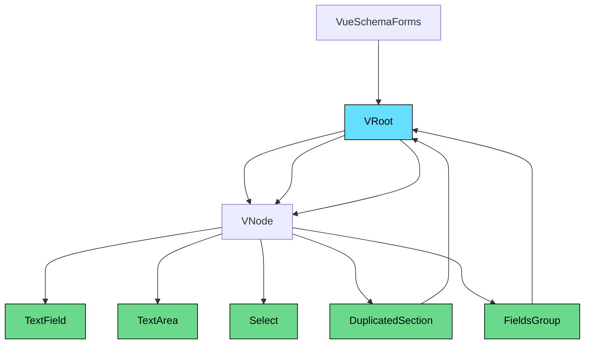
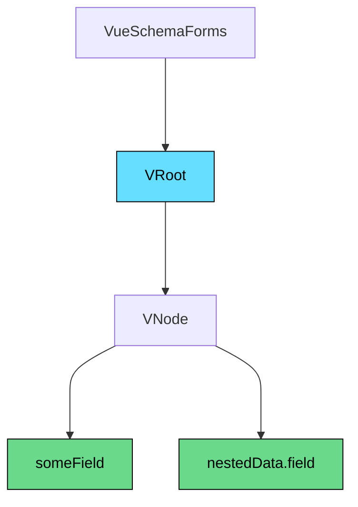

# Vue3 Schema Forms 🚀

> **Dynamic JSON Schema-powered forms for Vue 3 + Vuetify.**

Easily build dynamic, user-friendly, and customizable forms using JSON Schema, powered by [Vue 3](https://vuejs.org/) and [Vuetify 3](https://next.vuetifyjs.com/).

Inspired by [vuetify-jsonschema-form](https://koumoul-dev.github.io/vuetify-jsonschema-form/latest/).

---

## 📚 Documentation

- **Storybook (live preview):** [View Demo](https://maciejdybowski.github.io/vue3-schema-forms/)
- **Changelog:** [See latest changes](https://maciejdybowski.github.io/vue3-schema-forms/?path=/docs/changelog--docs)
- **Example App:** [GitHub Repo](https://github.com/MaciejDybowski/vue3-schema-forms-demo-app)

---

## ⚙️ Installation

```bash
npm install vue3-schema-forms
```

> **Peer dependencies required:**

```bash
npm install vue@3.4.14 vuetify@3.5.1 axios@1.6.5 dayjs@1.11.10 pinia@2.1.7 vue-i18n@9 vuedraggable@next
```

> **Optional for SFC i18n support:**

```bash
npm install -D @intlify/unplugin-vue-i18n@0.13.0
```

---

## ✨ Features

- 🚀 Dynamic form generation based on JSON Schema
- 🎨 Full Vuetify 3 integration
- 🌍 Built-in i18n support
- 🧩 Drag & Drop (with `vuedraggable`)
- 🔥 Form sections duplication
- 🛠️ Customizable validation and error display

---

## 📐 Quick Usage

```typescript
import { createVueSchemaForms } from 'vue3-schema-forms';

const schemaForms = createVueSchemaForms({});

createApp(App)
  .use(schemaForms)
  .mount('#app');
```

```vue
<template>
  <vue-schema-forms
    v-model="model"
    :schema="schema"
    :options="formOptions"
    :default-form-actions="true"
    validation-behaviour="messages"
  />
</template>

<script setup lang="ts">
import { ref } from 'vue';

const model = ref({});
const formOptions = ref({});
const schema = ref({
  type: 'object',
  properties: {
    field1: {
      label: 'Field 1',
      layout: {
        component: 'text-field',
      },
    },
  },
});
</script>
```

---

## 📋 Props

| Name                | Type                | Default  | Description                                                                                                                                         |
|---------------------|---------------------|----------|-----------------------------------------------------------------------------------------------------------------------------------------------------|
| `model`             | `object`             | —        | Two-way binding for form values.                                                                                                                    |
| `schema`            | `Schema`             | —        | JSON Schema object defining fields, types, and layouts.                                                                                             |
| `options`           | `object`             | —        | Global options applied to all fields.                                                                                                               |
| `defaultFormActions`| `boolean`            | `false`  | Toggles default form buttons (Submit / Reset).                                                                                                      |
| `validationBehaviour` | `"scroll" \| "messages"` | `"scroll"` | Defines validation behavior after error (auto-scroll to first invalid field or show messages).                                                      |

---

## ⚙️ Options

Field props priorities:

> Defaults → Field Props → Input Type Props → Layout-specific Props

Default values:

| Name               | Type   | Default                                                                 |
|--------------------|--------|-------------------------------------------------------------------------|
| `digitsAfterDecimal` | number | `2`                                                                     |
| `fieldProps`         | object | `-`                                                                     |
| `textFieldProps`     | object | `{ hide-details: 'auto' }`                                               |
| `textAreaProps`      | object | `{ rows: 3, hide-details: 'auto', auto-grow: true }`                    |
| `radioButtonProps`   | object | `{ density: 'compact', hide-details: 'auto' }`                          |
| `checkboxProps`      | object | `{ density: 'compact', hide-details: 'auto', multiple: true }`           |
| `selectProps`        | object | `{ hide-details: 'auto' }`                                               |
| `buttonProps`        | object | `-`                                                                     |

---

## 🎯 Slots

| Name         | Description                                                                                                                                                                              |
|--------------|------------------------------------------------------------------------------------------------------------------------------------------------------------------------------------------|
| `formActions` | Customize form actions (submit, reset, validate). Default implementation provided. You can override it and use exposed validation functions. [Example](https://maciejdybowski.github.io/vue3-schema-forms/?path=/story/forms-features-validations--add-custom-submit-with-built-in-validation) |

---

## 📦 Components Structure

> *(Rendered using Mermaid diagrams)*



---

## 📑 JSON Schema Flattening

Flattened key notation for nested fields:

```json
{
  "type": "object",
  "properties": {
    "someField": {
      "label": "Some field",
      "layout": {
        "component": "text-field"
      }
    },
    "nestedData": {
      "properties": {
        "field": {
          "label": "Nested field",
          "layout": {
            "component": "text-field"
          }
        }
      }
    }
  }
}
```

Visualized:



---

## 📞 Integrated Fields

| Component         | Default Configuration                                                                                                                                                                          | Description                              | Link                                  |
|-------------------|--------------------------------------------------------------------------------------------------------------------------------------------------------------------------------------------------|------------------------------------------|---------------------------------------|
| `v-phone-input`    | `{ 'country-icon-mode': 'svg', 'countryLabel': t('countryLabel'), 'guess-country': true, 'include-countries': ['pl', 'gb', 'ru', 'de', 'us', 'es', 'fr', 'it'] }` | International phone input for Vue 3 + Vuetify | [Source](https...) |

---

## Tests

1. ```cd``` to the project directory
2. Install development dependencies: ```npm install```
3. Run the tests: ```npm test```
4. Run the storybook: ```npm run storybook```
5. Run storybook tests: ```npm run test-storybook```

## Contributing

1. Fork it!
2. Create your feature branch: ```git checkout -b my-new-feature```
3. Commit your changes: ```git commit -am 'Add some feature'```
4. Push to the branch: ```git push origin my-new-feature```
5. Submit a pull request


## 🛡️ License

[MIT](LICENSE)
