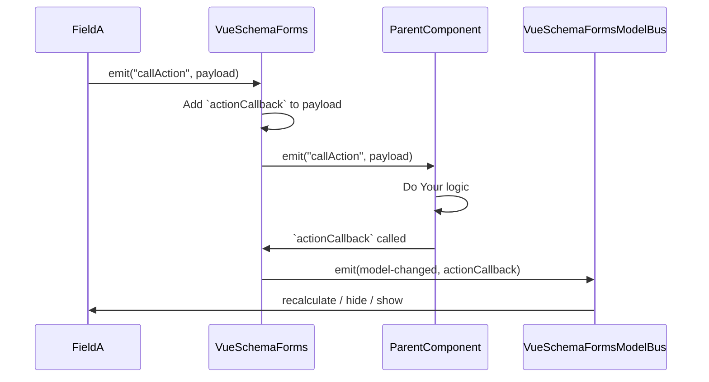
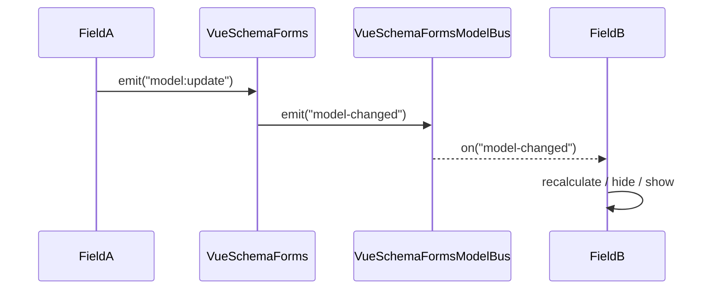
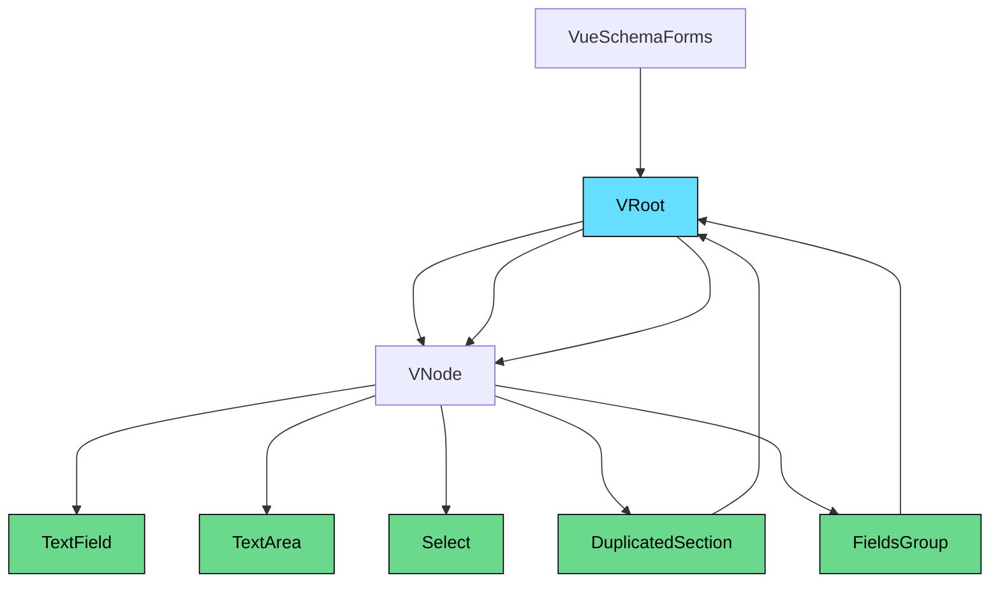
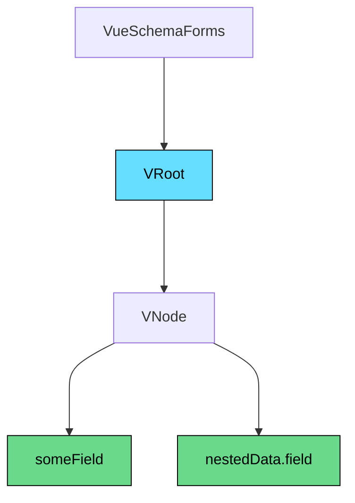

import { Meta } from '@storybook/addon-docs/blocks';

<Meta title="Homepage" />

# Vue3 Schema Forms 🚀

> **Dynamic JSON Schema-powered forms for Vue 3 + Vuetify.**

Easily build dynamic, user-friendly, and customizable forms using JSON Schema, powered by [Vue 3](https://vuejs.org/)
and [Vuetify 3](https://next.vuetifyjs.com/).

Inspired by [vuetify-jsonschema-form](https://koumoul-dev.github.io/vuetify-jsonschema-form/latest/).

---

## 📚 Documentation

- **Storybook (live preview):** [View Demo](https://aureadev.tecna.pl/storybook)
- **Changelog:** [See latest changes](https://aureadev.tecna.pl/storybook/?path=/docs/changelog--docs)
- **Wiki Docs** [Wiki](https://wiki.aurea.software/pl/projektowanie/silnik-formularzy)

---

## ⚙️ Installation

```bash
npm install vue3-schema-forms
```

> **Peer dependencies required:**

```bash
npm install vue@3.4.14 vuetify@3.5.1 axios@1.6.5 dayjs@1.11.10 vue-i18n@9 vuedraggable@next
```

> **Optional for SFC i18n support:**

```bash
npm install -D @intlify/unplugin-vue-i18n@0.13.0
```

---

## ✨ Features

- 🚀 Dynamic form generation based on JSON Schema
- 🎨 Full Vuetify 3 integration
- 🌍 Built-in i18n support
- 🧩 Drag & Drop (with `vuedraggable`)
- 🔥 Form sections duplication
- 🛠️ Customizable validation and error display

---

## 📐 Quick Usage

```typescript
import { createVueSchemaForms } from 'vue3-schema-forms';

const schemaForms = createVueSchemaForms({});

createApp(App)
  .use(schemaForms)
  .mount('#app');
```

```vue

<template>
  <vue-schema-forms
    v-model="model"
    :schema="schema"
    :options="formOptions"
    :default-form-actions="true"
    validation-behaviour="messages"
  />
</template>

<script setup lang="ts">
  import { ref } from 'vue';

  const model = ref({});
  const formOptions = ref({});
  const schema = ref({
    type: 'object',
    properties: {
      field1: {
        label: 'Field 1',
        layout: {
          component: 'text-field',
        },
      },
    },
  });
</script>
```

---

---

## 📋 Props

<table>
  <thead>
  <tr>
    <th>Name</th>
    <th>Type</th>
    <th>Default</th>
    <th>Description</th>
  </tr>
  </thead>
  <tbody>
  <tr>
    <td><code>model</code></td>
    <td><code>object</code></td>
    <td>—</td>
    <td>Two-way binding for form values.</td>
  </tr>
  <tr>
    <td><code>schema</code></td>
    <td><code>Schema</code></td>
    <td>—</td>
    <td>JSON Schema object defining fields, types, and layouts.</td>
  </tr>
  <tr>
    <td><code>options</code></td>
    <td><code>object</code></td>
    <td>—</td>
    <td>Global options applied to all fields.</td>
  </tr>
  <tr>
    <td><code>defaultFormActions</code></td>
    <td><code>boolean</code></td>
    <td><code>false</code></td>
    <td>Toggles default form buttons (Submit / Reset).</td>
  </tr>
  <tr>
    <td><code>validationBehaviour</code></td>
    <td><code>"scroll" | "messages" | "combined"</code></td>
    <td><code>"scroll"</code></td>
    <td>Defines validation behavior after error (auto-scroll to first invalid field or show messages).</td>
  </tr>
  </tbody>
</table>

---


## 📋 Emits

<table>
  <thead>
  <tr>
    <th>Name</th>
    <th>Type</th>
    <th>Default</th>
    <th>Description</th>
  </tr>
  </thead>
  <tbody>
  <tr>
    <td><code>isFormReady</code></td>
    <td><code>void</code></td>
    <td>—</td>
    <td>Signal for Parent component when form is ready to ex. watch for model</td>
  </tr>
  <tr>
    <td><code>callAction</code></td>
    <td><code>object</code></td>
    <td>—</td>
    <td>
      <code>payload: &#123; code: string; body: Record&lt;any, any&gt;; params: Record&lt;any, any&gt;, payload:
        Function&lt;Void&gt; &#125;</code>
      <br />
      Object for execute external actions / logic which is not connected directly with form
    </td>
  </tr>
  </tbody>
</table>


There are many possibilities to integrate actions with external sources. It is possible to call an API to refresh the form or perform recalculations, depending on the action definition. A callback function is added by default, but it can be overridden if needed.




---

## 📋 Exposed

<table>
  <thead>
  <tr>
    <th>Name</th>
    <th>Type</th>
    <th>Default</th>
    <th>Description</th>
  </tr>
  </thead>
  <tbody>
  <tr>
    <td><code>validate</code></td>
    <td><code>function</code></td>
    <td>—</td>
    <td>For validation by <code>ref</code></td>
  </tr>
  <tr>
    <td><code>reset</code></td>
    <td><code>function</code></td>
    <td>—</td>
    <td>For reset whole form by <code>ref</code></td>
  </tr>
  <tr>
    <td><code>resetValidation</code></td>
    <td><code>function</code></td>
    <td>—</td>
    <td>For reset validation by <code>ref</code></td>
  </tr>
  <tr>
    <td><code>formDataWasSaved</code></td>
    <td><code>boolean</code></td>
    <td>—</td>
    <td>For provide to form information about external state of form</td>
  </tr>
  </tbody>
</table>

---

## ⚙️ Options

Field props priorities:

> Defaults → Field Props → Input Type Props → Layout-specific Props

Default values:

<table>
  <thead>
  <tr>
    <th>Name</th>
    <th>Type</th>
    <th>Default</th>
  </tr>
  </thead>
  <tbody>
  <tr>
    <td><code>fieldProps</code></td>
    <td>object</td>
    <td><code>-</code></td>
  </tr>
  <tr>
    <td><code>textFieldProps</code></td>
    <td>object</td>
    <td><code>&#123; hide-details: false &#125;</code></td>
  </tr>
  <tr>
    <td><code>textAreaProps</code></td>
    <td>object</td>
    <td><code>&#123; rows: 3, hide-details: false, auto-grow: true &#125;</code></td>
  </tr>
  <tr>
    <td><code>radioButtonProps</code></td>
    <td>object</td>
    <td><code>&#123; density: 'compact', hide-details: false &#125;</code></td>
  </tr>
  <tr>
    <td><code>checkboxProps</code></td>
    <td>object</td>
    <td><code>&#123; density: 'compact', hide-details: false, multiple: true &#125;</code></td>
  </tr>
  <tr>
    <td><code>selectProps</code></td>
    <td>object</td>
    <td><code>&#123; hide-details: false &#125;</code></td>
  </tr>
  <tr>
    <td><code>buttonProps</code></td>
    <td>object</td>
    <td><code>-</code></td>
  </tr>
  <tr>
    <td><code>dictionaryProps</code></td>
    <td>object</td>
    <td><code>&#123; labels: '[]Label' &#125;</code></td>
  </tr>
  </tbody>
</table>


---

## 🎯 Slots

<table>
  <thead>
  <tr>
    <th>Name</th>
    <th>Description</th>
  </tr>
  </thead>
  <tbody>
  <tr>
    <td><code>formActions</code></td>
    <td>
      Customize form actions (submit, reset, validate). Default implementation provided. You can override it and use exposed validation functions.
      <a href="https://aureadev.tecna.pl/storybook/?path=/story/features-validations-behaviour--add-custom-submit-with-built-in-validation">Example</a>
    </td>
  </tr>
  </tbody>
</table>

---

## 🧩 Internal Communication – Event Bus

Internal communication within the form engine is built on a **shared event bus**, which allows for efficient and
decoupled communication between components.

This mechanism powers critical functionalities such as:

- 🔍 **Visibility control**
- 🔄 **Reactive dependencies**
- 🧮 **Calculations**
- ✏️ **Expressions**
- ⚙️ **Dynamic props injection**
- …and much more.

### 📡 Event Bus Architecture

We utilize `useEventBus` from VueUse to define scoped communication channels:

```ts
// Emits model updates to all fields
const vueSchemaFormEventBus = useEventBus<string>("form-model");

// Triggers external actions, handled by the parent component
const actionHandlerEventBus = useEventBus<string>("form-action");
```

### ⏱️ Delay Strategy for Listener Execution

To avoid race conditions and ensure correct evaluation order, we introduce small delays when triggering certain
listeners:

<table>
  <thead>
  <tr>
    <th>Feature</th>
    <th>Delay</th>
    <th>Purpose</th>
  </tr>
  </thead>
  <tbody>
  <tr>
    <td>Calculations</td>
    <td><code>5ms</code></td>
    <td>Ensures fresh model values</td>
  </tr>
  <tr>
    <td>Prop updates</td>
    <td><code>10ms</code></td>
    <td>Waits for model + calc to settle</td>
  </tr>
  <tr>
    <td>Decimal places</td>
    <td><code>10ms</code></td>
    <td>Waits for model changes</td>
  </tr>
  <tr>
    <td>Visibility (<code>if</code> / <code>hide</code>)</td>
    <td><code>50ms</code></td>
    <td>Triggers after all other logic</td>
  </tr>
  </tbody>
</table>


This staging guarantees that dependent logic (e.g., showing/hiding fields) reacts only after all inputs and computed
values have been finalized.

### 📊 Event Propagation Diagram

> *(Rendered using Mermaid diagrams)*



## 📦 Components Structure

The diagram below illustrates the generic hierarchical structure of a form built with VueSchemaForms. It starts from the
root component (`VRoot`), which serves as the entry point of the form. From there, the form tree is composed of `VNode`
elements representing various field types, such as `TextField`, `TextArea`, and `Select`. Complex structures like
`DuplicatedSection` and `FieldsGroup` can contain nested roots and nodes, enabling a flexible and recursive form
composition.

> *(Rendered using Mermaid diagrams)*



---

### 📑 JSON Schema Flattening

Flattened key notation allows representing nested fields in a simple, dot-notated structure.

The diagram below visualizes how a form tree is structured in VueSchemaForms:  
starting from the root (`VRoot`), it branches into nodes (`VNode`) representing fields like `someField` and nested ones such as `nestedData.field`.


```json
{
  "type": "object",
  "properties": {
    "someField": {
      "label": "Some field",
      "layout": {
        "component": "text-field"
      }
    },
    "nestedData": {
      "properties": {
        "field": {
          "label": "Nested field",
          "layout": {
            "component": "text-field"
          }
        }
      }
    }
  }
}
```

Visualized:
> *(Rendered using Mermaid diagrams)*



---

## 📞 Integrated Fields

<table>
  <thead>
  <tr>
    <th>Component</th>
    <th>Default Configuration</th>
    <th>Description</th>
    <th>Link</th>
  </tr>
  </thead>
  <tbody>
  <tr>
    <td><code>v-phone-input</code></td>
    <td><code>&#123; 'country-icon-mode': 'svg', 'countryLabel': t('countryLabel'), 'guess-country': true, 'include-countries': ['pl', 'gb', 'ru', 'de', 'us', 'es', 'fr', 'it'] &#125;</code></td>
    <td>International phone input for Vue 3 + Vuetify</td>
    <td><a href="https...">Source</a></td>
  </tr>
  </tbody>
</table>

---

## Tests

1. ```cd``` to the project directory
2. Install development dependencies: ```npm install```
3. Run the tests: ```npm test```
4. Run the storybook: ```npm run storybook```
5. Run storybook tests: ```npm run test-storybook```

## Contributing

1. Fork it!
2. Create your feature branch: ```git checkout -b my-new-feature```
3. Commit your changes: ```git commit -am 'Add some feature'```
4. Push to the branch: ```git push origin my-new-feature```
5. Submit a pull request